# Medical Master (Medic-M)

| WELCOME TO Medic-M(MEDICAL MASTER) |

 ---------------
| Introduction |
 ---------------

Medical Master or "Medic-M" was built to reduce the hassle of buying medicine, provide medicine to the sick in a short time. It is an HTML, CSS, JAVASCRIPT and PHP based system. We have tried to complete the full project with all of the required criteria. The User can get the best service from this system at any time. 

Thank you everyone.

>> YouTube video link: 

-------------------
| Required System |
-------------------

 >> Visual Studio Code
 
 >> XAMPP
 
 >> MySQL Server

--------------------------
| Minimum Specifications |
--------------------------

    1. Operating System : Windows® 7/8/10/11
    2. Processor	: Intel® Core™ i3
    3. Memory		: 1 GB RAM
    4. Graphics		: Not Required
    5. Network		: Broadband Internet Connection
    6. Storage		: 500 MB

--------------
| How to run |
--------------

 >> First, copy the "Medic-M" folder and go to your Local Disc (C).
 
 >> After installing "XAMPP" there will be a "xampp" folder. 
 
 >> In "xampp" folder go to "htdocs" folder and paste the folder "Medic-M"
 
 >> Open xampp controle panel and start the actions of "Apache" and "MySQL" module.
 
 >> Open any browser of your device and paste "localhost/Medic-M/View/".
 
 >> The browser will open the application and the system will be ready to use.

--------------------
| How to use "Medic-M" |
--------------------

 >> To get access to the administrative permissions, administrator UserId is: "admin" & Password: "admin".
 
 >> You can sign up as Admin also.
 
 >> If you want to sell medicine, make sure you have signed up as a "Seller".
 
 >> After sign up log in as a "Seller" to add and deliver product.
 
 >> To buy medicines, sign up as "Customer".
 
 >> Before placing an order, Customer can remove or add a product to the cart in the "Buy Products" option.
 
 >> There are 3 different users: Admin, Seller & Customer.

   Admin :
   
	   1. Profile                    	   - Admin all details will be shown.
           2. Edit Profile                         - Edit profile details without mail and username.
           3. Medic-M Bank                         - A specific amount from all oders is added in account. Also can deposit or Withdraw money from account.
	   2. Search User               	   - Admin can view all User, search User and Ban User for specific reason.
	   3. View Orders                          - Search and View all placced orders.
	   4. View Products             	   - Search, View and Delete products.

   Seller :

	   1. Profile                    	   - Seller all details will be shown.
           2. Edit Profile                         - Edit profile details without mail and username.
           3. Medic-M Bank                         - After any order the amount without charge is added in account. Also can deposit or Withdraw money from account.
	   2. Search Product               	   - Seller can search and view products. Also can add product in cart.
	   3. Your Products                        - Seller can add, edit remove or view recent products.
	   4. Notification                	   - All pending deliveries will be notified here.

   Customer :

	   1. Profile                    	   - Customer all details will be shown.
           2. Edit Profile                         - Edit profile details without mail and username.
           3. Medic-M Bank                         - After any order the amount is deducted from account. Also can deposit or Withdraw money from account.
	   2. Search Product               	   - Customer can search and view products. Also can add product in cart.
	   3. Order List                           - All ordered products will be given here.
	   4. Buy Products                	   - Buy products, add or remove products from cart.

---------------------------
| Background Informations |
---------------------------

Digitization has revolutionized all industry sectors. Now everything has become easy and digital in this modern world. People are getting their essential items at their fingertips in no time. So, to cope with the digital world, we also need to be advanced and provide the best services to people. But still, the medical sector is not advanced yet.

From research, we found that about 90 million people are affected by any diseases in Bangladesh. In most hospitals, various types of medicines are needed all the time. But currently, all medicines are not available all the time. Also, people sick at home can not go to stores to buy medicine. A delivery service should be provided to those people at home.

Medic-M is deals with the medical components and is a marketplace for daily life medical equipment. This system will make providing the best medicine to the consumers with all the precautions possible.

----------------------------
| Developer's Informations |
----------------------------

         1. Niloy Kanti Paul
	    Email	: niloykantipaul@gmail.com
	    LinkedIn	: https://www.linkedin.com/in/niloy-kanti-paul-5543181ab/
	    Github	: https://github.com/DEV-NKP

         2. Dipanwita Saha
            Email	: dipanwitasaha7009@gmail.com
	    LinkedIn	: https://www.linkedin.com/in/dipanwita-saha-a772aa215/
	    Github	: https://github.com/Dipanwita-Saha

	 3. Kaushik Biswas
	    Email	: biswaskaushik.2020@gmail.com
	    LinkedIn	: https://www.linkedin.com/in/kaushik-biswas-2b6554243/
	    Github	: https://github.com/Kaushik-Biswas

	 

----------------------
| Project Highlights |
----------------------

> At the very first, an attractive landing page with developers' information will be presented.
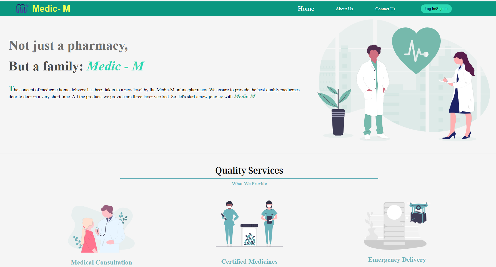

> Medic-M has it's own designed logo .

> A pop up log in page will arrive at the time of log in.
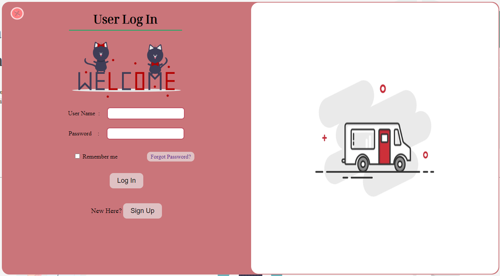

> Medic-M has three different sign up page for different users.
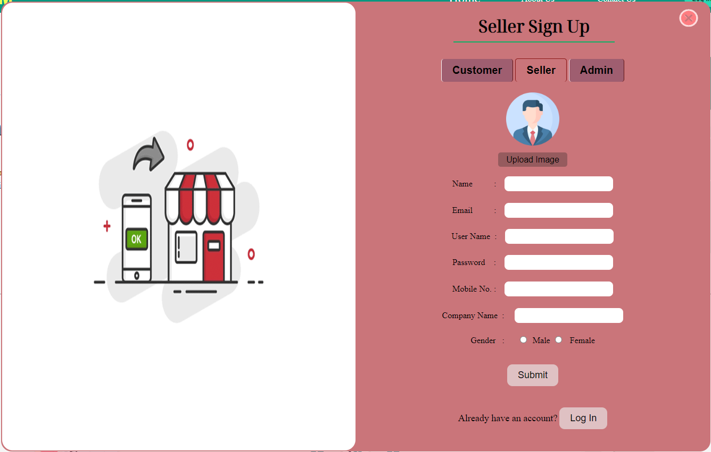

> Admin can ban users for any suspicious tasks.
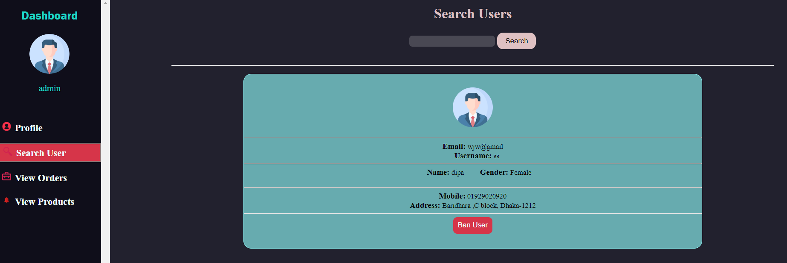

> Admin can view products and delete medicines.
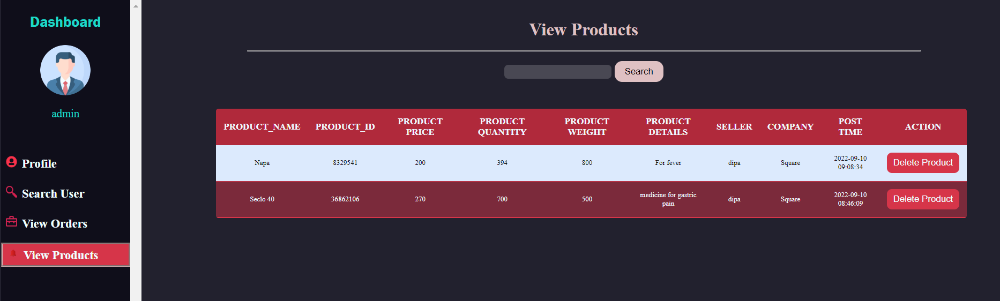

> In the profile section, all user data are given and a Bank option is there for every User.
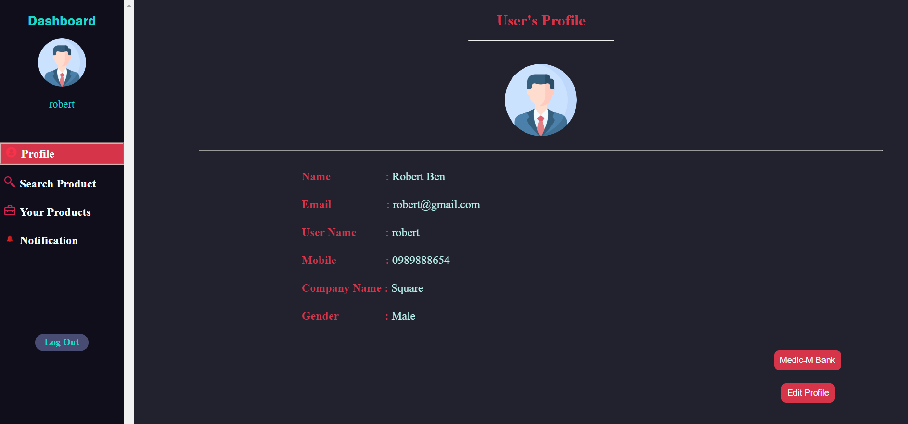

> User can deposit or withdraw money from account.
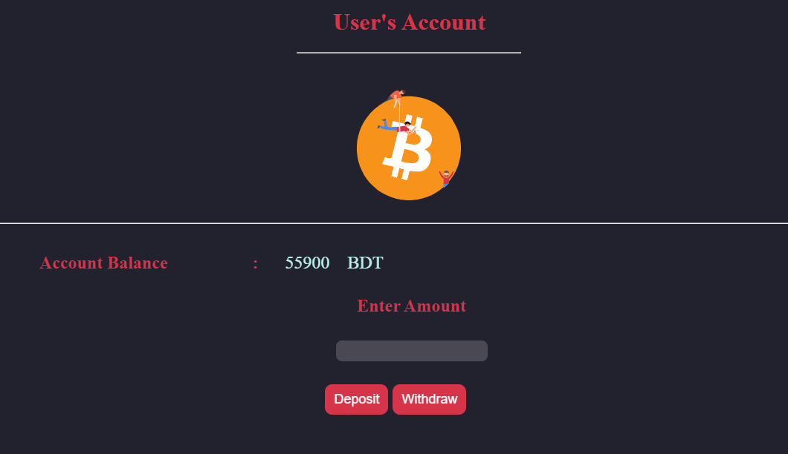

> Customer can search medicine, increase the quantity and add medicine in cart.
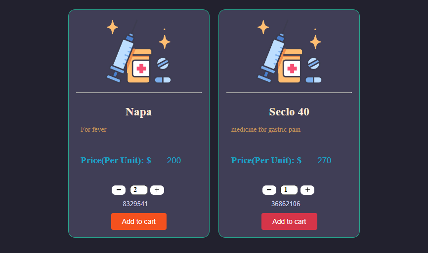

> Before placing order, Customer can add or remove medicine from cart.
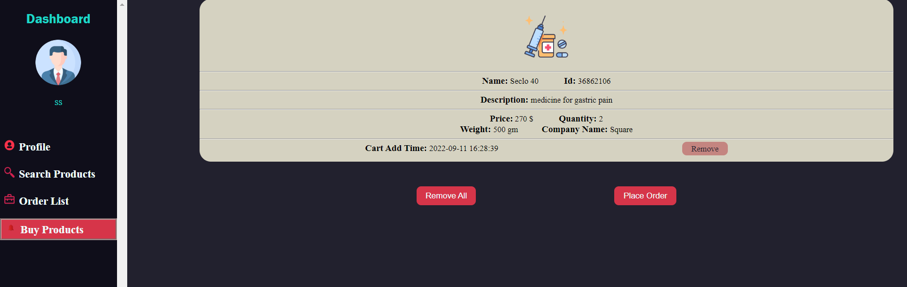

> After placing order, a payment receipt will be given to Customer.
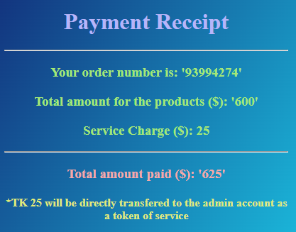

> There are stuctured option of product for Seller.
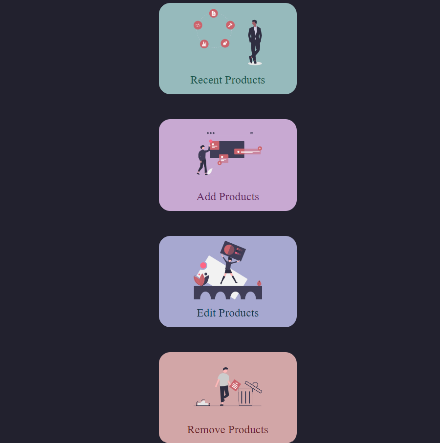

> User can see resently added medicines .
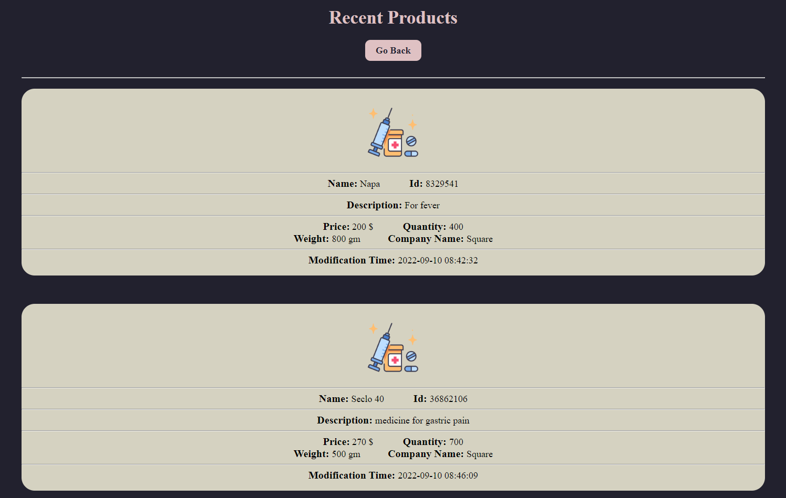

> Seller can search and see the medicine details.
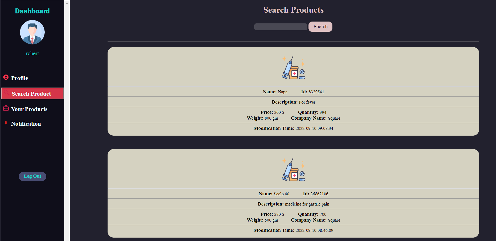

> From the notification, Seller can get the pending delivery notification. The cart add time will be visible from both User end.
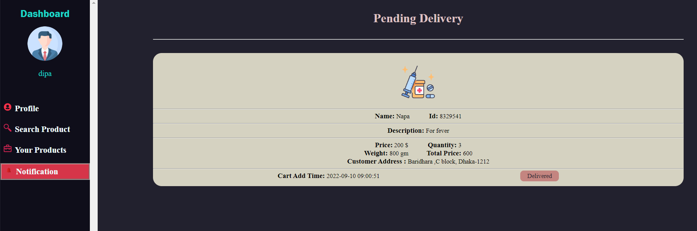

********************************************ⒸAll Rights Reserved By "TEAM_DELTA"********************************************

